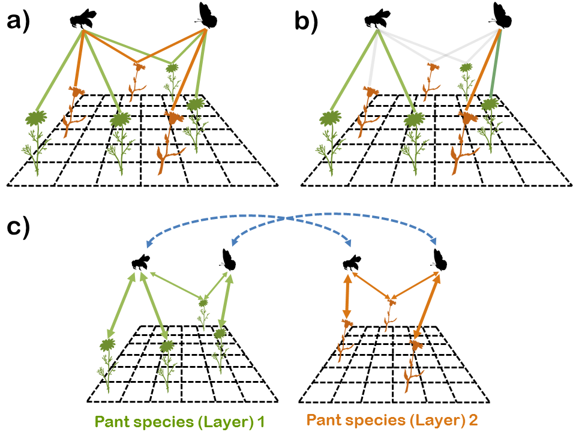
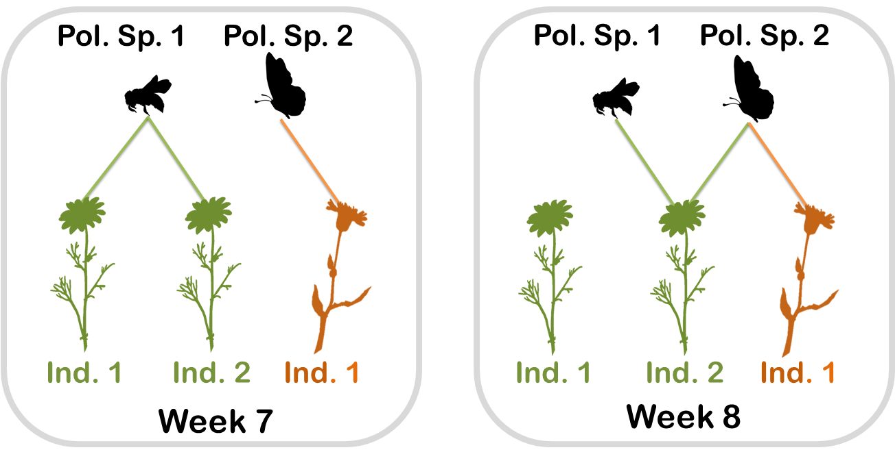

# Multi-motif analysis

This repo contain all analysis for the paper entitled "Community level individual-based plant-pollinator networks unveil pollen flow dynamics and plant reproductive success" by Alfonso Allen-Perkins, María Hurtado, David García-Callejas, Oscar Godoy, and Ignasi Bartomeus, where we study the effect of several macro-, meso- and microstructural descriptors of Caracoles' individual-based plant-pollinator multilayer networks (2020) on the reproductive success of their focal plant individuals. To do so, we downscaled the analysis of interactions based on motifs to the level of conspecific and heterospecific plant individuals.


* Raw data on pollination, fitness and competition at Caracoles can be found in the folder `Raw_Data/`
* Processed data (such as the layers of our networks, the data we used to feed our models, or the results of our null model calculations) can be found in the folder `Processed_data/`
* Functions can be found in the folder `R_Scripts/`

You can find below examples on how to calculate (i) modules and centrality metrics, as well as (ii) the total amount of homospecific and heterospecific triplets per week and pollinator. To run the examples, you need install the infomapecology package by S. Pilosof, C. Farage, and D. Edler. You can find the Infomap installation guide here[here](https://github.com/Ecological-Complexity-Lab/infomap_ecology_package).

# Calculating modules and centrality metrics: An example.

To run the this example I will use the functions in `R_Scripts/functions.R` and the data in `Example/example.csv`. The metadata in `Example/example.csv` can be described as follows:
* Plot: network/site/year ID.
* Subplot: plant individual ID.
* Plant: plant species ID.
* ID: visitor species ID.
* Visits: number of visits recorded between the plant individual and the visitor species.
* Week: number of the week.

In the figure below we show the information in `Example/example.csv`.


We will obtain the following information:
* Real_PR_Multi: the PageRank index, whose value represents the probability of finding a grain of pollen (that diffuses on the system) in a given node, after a long time. This variable provides the PageRank value when the multilayer is coupled. 
* Real_PR_Layer: the PageRank value when the layers are isolated.
* StrengthIn: the in-stregth of a node.
* StrengthOut: the out-stregth of a node.
* DegreeIn: the in-degree of a node.
* DegreeOut: the out-degree of a node.
* Delta: Real_PR_Multi - Real_PR_Layer
* Ratio: Real_PR_Multi / Real_PR_Layer

```
# Load relevant libraries
library(infomapecology)
# Infomap installation guide:
# https://github.com/Ecological-Complexity-Lab/infomap_ecology_package
library(attempt)
library(igraph)
library(tidyverse)
source("R_scripts/functions.R")
source("R_scripts/run_infomap_monolayer2.R") # function to parse infomap's tree files


dir_ini <- getwd() # Register working directory

example_raw <- read_csv("Example/example.csv")

# Aggregate visits per plant individual, week and floral visitor
example <- example_raw %>% group_by(Plot,Subplot,Plant,ID,Week) %>% count(wt = Visits) %>%
  rename(Visits=n)
  
list_sites <- example$Plot %>% unique() # List of networks IDs

centrality_final <- NULL # Variable to save centrality metrics
plot_modules_NN_final <- NULL # Variable to save module partitions

for (Plot_i in list_sites){
 
  # Create a (Node-Colored) Multilayer (Directed) edge-list
  
  plot_edge_list <- example %>% ungroup() %>% filter(Plot==Plot_i) %>%
    group_by(Plot,Subplot,Plant,ID) %>% count(wt=Visits) %>% ungroup() %>%
    mutate(from = paste0(Subplot," ",Plant)) %>% 
    rename(to = ID, weight = n, species = Plant) %>%
    dplyr::select(from, to, weight, species)
  
  
  # Extract multilayer info
  
  pollinators <- sort(unique(plot_edge_list$to)) 
  plants <- sort(unique(plot_edge_list$from))
  layer_plant <- sort(unique(plot_edge_list$species))
  
  # Sanity check
  intersect(pollinators, plants)
  
  A <- length(pollinators) # Number of pollinators
  P <- length(plants) # Number of plants
  S <- A + P
  
  # Create a table with node metadata
  physical_nodes <- tibble(node_id=1:S,
                           type=c(rep('plant',P),rep('pollinator',A)),
                           species=c(plants,pollinators))
  layer_metadata <- tibble(layer_id=1:length(layer_plant), layer_name=layer_plant)
  
  
  # Create a list that contains directed and weighted intra- and inter-links
  
  S_edge_list <- create_weighted_link_list(plot_edge_lis)
  
  # Extract modules for Plot_i from the network of networks representation with infomap
  
  plot_modules_NN_i <- extract_modules_NN_infomapec(S_edge_list)
  
  # Extract centrality metrics for Plot_i
  
  centrality_i <- centrality_metrics_NN(S_edge_list)
    
  # Update final variables with Plot_i results
  
  plot_modules_NN_final <- bind_rows(plot_modules_NN_final,plot_modules_NN_i)
  centrality_final <- bind_rows(centrality_final,centrality_i)
 
  setwd(dir_ini)

}

plot_modules_NN_final

# A tibble: 6 x 6
  node_id module species          layer_name  Plot type      
    <dbl>  <dbl> <chr>            <chr>      <dbl> <chr>     
1       1      1 Ind_1 Plant_Sp_A Plant_Sp_A     1 plant     
2       2      2 Ind_1 Plant_Sp_B Plant_Sp_B     1 plant     
3       3      1 Ind_2 Plant_Sp_A Plant_Sp_A     1 plant     
4       4      1 Poll_Sp_1        Plant_Sp_A     1 pollinator
5       5      2 Poll_Sp_2        Plant_Sp_B     1 pollinator
6       6      2 Poll_Sp_2        Plant_Sp_A     1 pollinator

centrality_final
               species Real_PR_Multi Real_PR_Layer StrengthIn StrengthOut DegreeIn DegreeOut
1     Ind_1 Plant_Sp_A    0.17439201    0.17416722  0.6666667           1        1         1
2 Poll_Sp_1 Plant_Sp_A    0.26363296    0.26323627  1.6666667           1        2         2
3     Ind_1 Plant_Sp_B    0.09558358    0.16666667  1.0000000           1        1         1
4 Poll_Sp_2 Plant_Sp_B    0.16607901    0.16666667  1.0000000           1        1         1
5     Ind_2 Plant_Sp_A    0.15952898    0.15916612  1.3333333           1        2         2
6 Poll_Sp_2 Plant_Sp_A    0.14078346    0.07009707  0.3333333           1        1         1
          Delta     Ratio Plot
1  0.0002247944 1.0012907    1
2  0.0003966960 1.0015070    1
3 -0.0710830865 0.5735015    1
4 -0.0005876545 0.9964741    1
5  0.0003628601 1.0022798    1
6  0.0706863905 2.0084073    1
```
Session info
```
sessionInfo()
R version 3.6.3 (2020-02-29)
Platform: x86_64-w64-mingw32/x64 (64-bit)
Running under: Windows 8.1 x64 (build 9600)

Matrix products: default

attached base packages:
[1] stats     graphics  grDevices utils     datasets  methods   base     

other attached packages:
 [1] forcats_0.4.0          stringr_1.4.0          dplyr_1.0.2            purrr_0.3.3           
 [5] readr_1.3.1            tidyr_1.0.2            tibble_3.0.3           ggplot2_3.3.2         
 [9] tidyverse_1.3.0        igraph_1.2.5           attempt_0.3.1          infomapecology_0.1.2.3
```

# Calculating the total amount of homospecific and heterospecific triplets per week and pollinator: An example.

Given a network, we can decompose it into smaller subgraphs, called motifs. Here we estimated the amount of undirected triplets that were present in our visitation networks, that is, the pattern of connections of undirected path graphs with length 2 (see panels a and b in the figure above). In addition, we restricted our analysis to triplets with two plant individuals. 

One novel aspect of our work consisted in downscaling the analysis of interactions based on motifs to the level of conspecific and heterospecific plant individuals. Here we introduced a new triplet classification according to the plant species involved. If both focal plants belong to the same species, the triplet was referred to as homospecific motif (see the bee's motif that is highlighted in panel b); otherwise, the motif was classified as heterospecific (see the butterfly's motif that is highlighted in panel b).

To incorporate species’ phenological overlap in our motif analysis, we calculated both types of triplets from the bipartite networks that arose weekly (see panel a for an example of such networks). Thus, heterospecific triplets only appear when different coflowering species that shared pollinators are present in a given week. Here, we show how to estimate total amount of homo- and of heterospecific triplets per week and floral visitor for a given plant.

To run the this example I will use again the functions in `R_Scripts/functions.R` and the data in `Example/example.csv`. See the example above for additional information on the `Example/example.csv`.

```
# load libraries
library(tidyverse)
library(bipartite)
library(igraph)

source("R_Scripts/functions.R")

# Loadind example dataset

example_data <- read_csv("Example/example.csv")

aggregate_total <- NULL # tibble that will contain the output

for (week_i in unique(example_data$Week)){

  # Extract data of week_i

  example_week_i <- example_data %>% filter(Week==week_i)
 
  # Aggregate visits by week 
 
  example_week_i <- example_week_i %>% group_by(Plot,Subplot,Plant,ID) %>%
    count(wt=Visits) %>% rename(Visits_tot = n)
  
  example_week_i$Subplot_Plant_Label <- paste(example_week_i$Subplot,example_week_i$Plant,sep = " ")
  
  aggregate_week_i <- example_week_i %>% ungroup() %>% 
    select(Plot,ID,Subplot_Plant_Label,Visits_tot)
    
  # Extract homospecific- and heterospecific triplets
  
  aggregate_week_i <- homo_hete_motifs(aggregate_week_i)
  aggregate_week_i <- aggregate_week_i %>% mutate(Week=week_i)
  
  # Update the output variable
  aggregate_total <-  bind_rows(aggregate_total, aggregate_week_i) 
  
}

aggregate_total %>% separate(Subplot_Plant_Label,c("Subplot","Plant"), " ")

# A tibble: 6 x 8
   Plot ID        Subplot Plant      Visits_tot homo_motif hete_motif  Week
  <dbl> <chr>     <chr>   <chr>           <dbl>      <int>      <int> <dbl>
1     1 Poll_Sp_1 Ind_1   Plant_Sp_A          4          1          0     7
2     1 Poll_Sp_2 Ind_1   Plant_Sp_B          1          0          0     7
3     1 Poll_Sp_1 Ind_2   Plant_Sp_A          1          1          0     7
4     1 Poll_Sp_2 Ind_1   Plant_Sp_B          1          0          1     8
5     1 Poll_Sp_1 Ind_2   Plant_Sp_A          1          0          0     8
6     1 Poll_Sp_2 Ind_2   Plant_Sp_A          1          0          1     8
```

Session info
```
sessionInfo()
R version 3.6.3 (2020-02-29)
Platform: x86_64-w64-mingw32/x64 (64-bit)
Running under: Windows 8.1 x64 (build 9600)

Matrix products: default

attached base packages:
[1] stats     graphics  grDevices utils     datasets  methods   base     

other attached packages:
 [1] bipartite_2.14       sna_2.5              network_1.16.0       statnet.common_4.3.0
 [5] vegan_2.5-6          lattice_0.20-38      permute_0.9-5        igraph_1.2.5        
 [9] forcats_0.4.0        stringr_1.4.0        dplyr_1.0.2          purrr_0.3.3         
[13] readr_1.3.1          tidyr_1.0.2          tibble_3.0.3         ggplot2_3.3.2       
[17] tidyverse_1.3.0  
```

# License
The code is released under the GNU General Public License v3.0 license (see LICENSE file).
